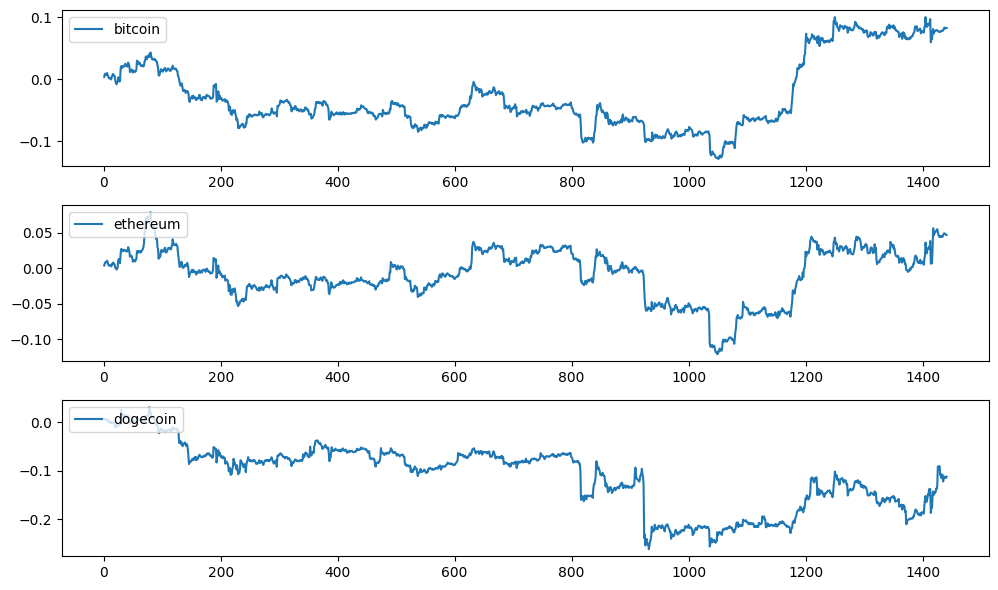

# Cryptocurrency-market-management-robot
The goal of this project is to develop a robot that manages the cryptocurrency market on behalf of users. It is capable of adding symbols to our internal market, getting daily and monthly price reports, creating a favorite list of cryptocurrencies, monitoring daily charts, and comparing cryptocurrencies.
The following are some examples of project output diagrams.

